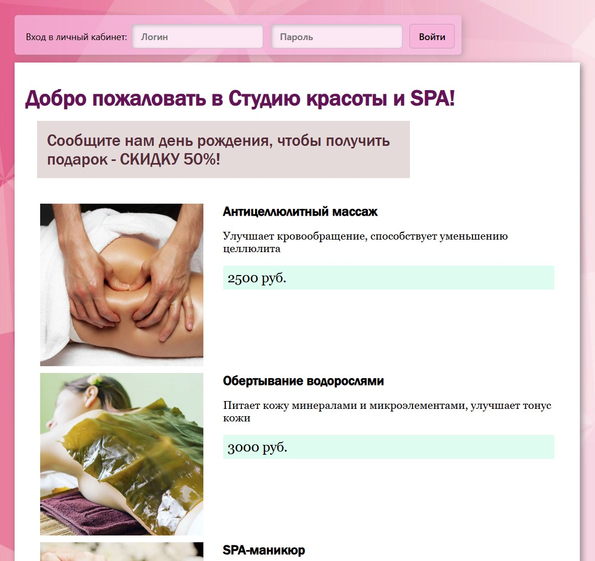
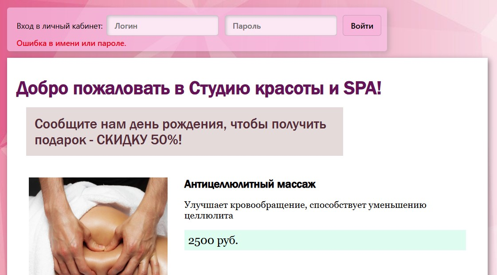
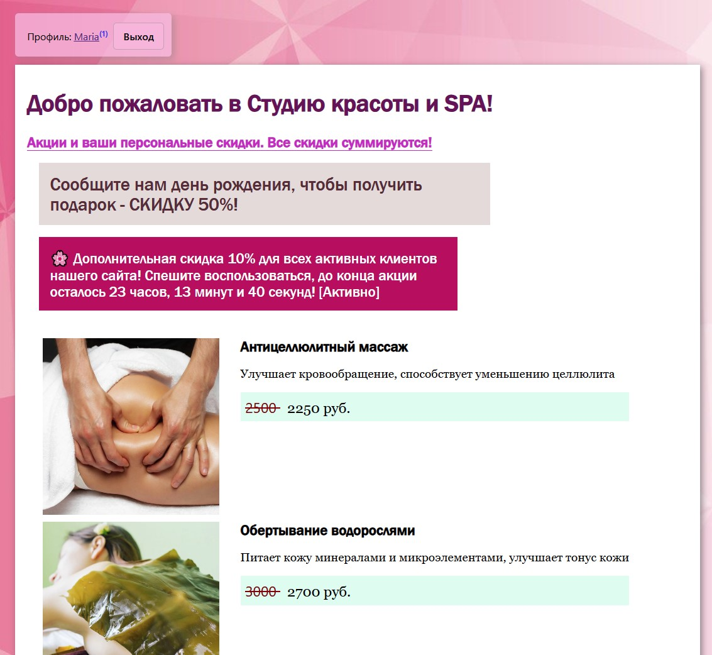
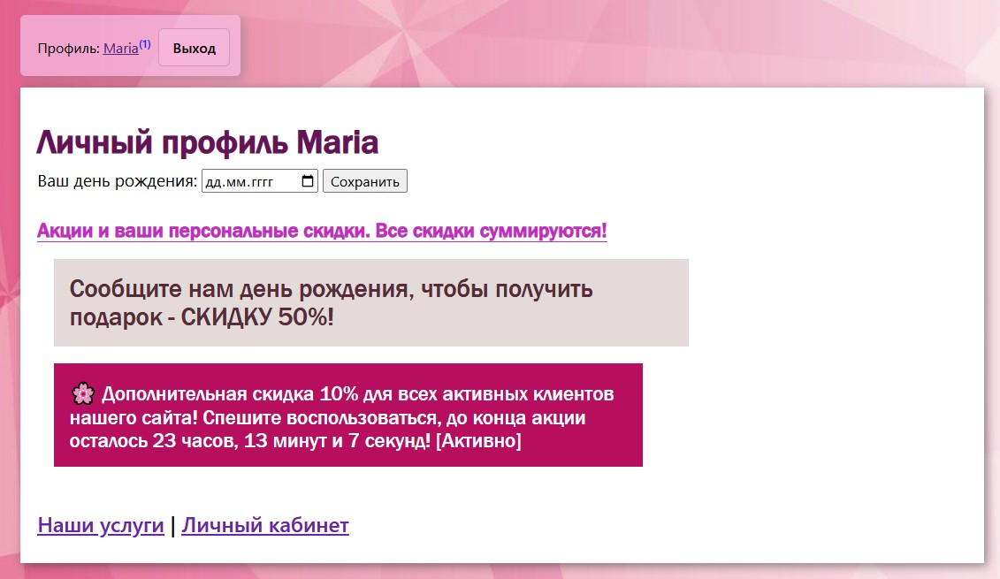
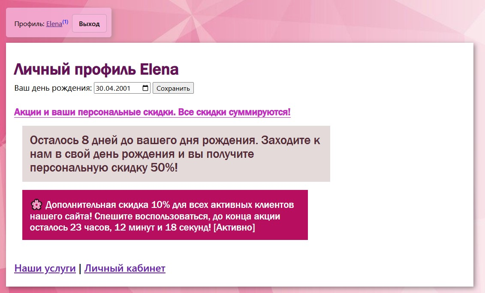
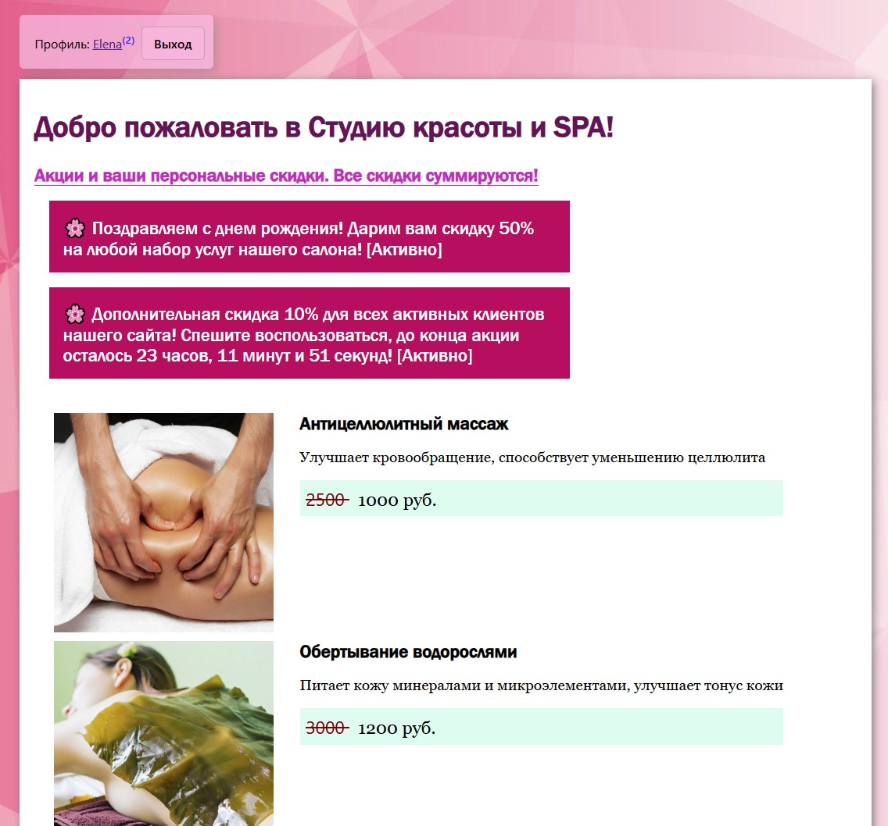

## Домашнее задание "Демо-версия сайта SPA-салона". Модуль 14. Практика по PHP. Куки, Сессии. Курс PHP-Pro (Skillfactory)
Автор: Александр Климок / [kydechuk01](https://github.com/kydechuk01/)
 Дата: 22.04.2024 

### В работе использованы:
- HTML5, PHP, CSS, Markdown
- Git via [github.com](https://github.com)
- Редактор VSCode

### Запуск проекта

* Файл [index.php](./index.php) - открыть через веб-сервер.

### Список решенных задач

- Созданы 2 базовые страницы сайта: [index.php](index.php) и [profile.php](profile.php)
  - **Титульная страница** позволяет войти на сайт, выводит нотификацию об скидке -50% в день рождения и выводит список услуг салона;
    - Список услуг салона хранится в JSON-формате в файле [data/services.json](data/services.json)
  - **Страница профиля** показывает статус логина, число уведомлений (активных скидок пользователя), кнопку выхода из профиля, список текущих акций пользователя. При попытке перехода на страницу профиля неавторизованного пользователя перебрасывает на титульную страницу сайта.
- Сделана возможность авторизации пользователей:
  - Список пользователей хранится в JSON-формате в файле [data/users.json](data/users.json), пароли пользователей хранятся в виде хэшей
  - Жестко заданы пользователи: "admin" (пароль: 123), "Maria" (пароль: 456), "Elena" (пароль: 789), создание новых аккаунтов не реализовано
  - признак того, что пользователь залогинен, сохраняется в куки `user`, сроком жизни на 24 часа
- Сделана возможность хранения в БД дня рождения пользователя (поле `birthdate`) и даты последнего входа пользователя (поле `lastlogin`). В целях отладки и тестирования возможность изменения (и удаления) ранее введенной даты дня рождения НЕ отключена.
- Сделана возможность выхода пользователя из его профиля
- Задано 2 типа акций (скидки суммируются):
    1) Скидка -10% залогиненному пользователю, вошедшему на сайт. Длится 24 часа с момента инициализации скидки, признак скидки хранится в куки пользователя `discountForLogin`, как значение времени инициализации скидки в unix-формате. При входе в профиль на сайте отображается, сколько часов, минут и секунд осталось до конца срока действия скидки. Если скидка прошла и куки удалилось, то при следующем входе на сайт акция опять запустится на новые 24 часа.
    2) Скидка -50% пользователю в его День рождения, если он указал дату в профиле. Если день рождения еще не наступил, то на сайте отображается, сколько дней осталось до следующего дня рождения пользователя. Подсчет дней также учитывает, прошел день рождения в этом году или еще нет. Если дата рождения не указана, то выводится нотификация с предложением ввести дату, чтобы получить скидку.

  
### Примеры вывода результатов работы
Базовый вид неавторизованного пользователя:

Ошибка авторизации:

Успешная авторизация, пользователь не указал дату рождения:

Успешная авторизация, страница профиля пользователя:

Страница профиля пользователя, указан день рождения 30.04.2001, сайт отображает, что осталось 8 дней до дня рождения.

Титульная страница авторизованного пользователя в его день рождения. Две акции суммируются и дают общую скидку на услуги в размере 60%.
